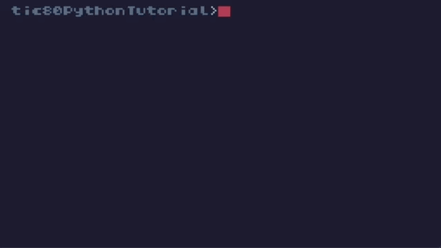

# TIC-80 Python Tutorial



# About
Stub & Example

- Stub: https://github.com/nesbox/TIC-80/wiki/Stub-file
- Original Code: https://github.com/nesbox/TIC-80/wiki/A-step-by-step-introduction-to-TIC-80,-Part-1---The-Default-Cart

# Usage
```
import code part1.py
run
```
